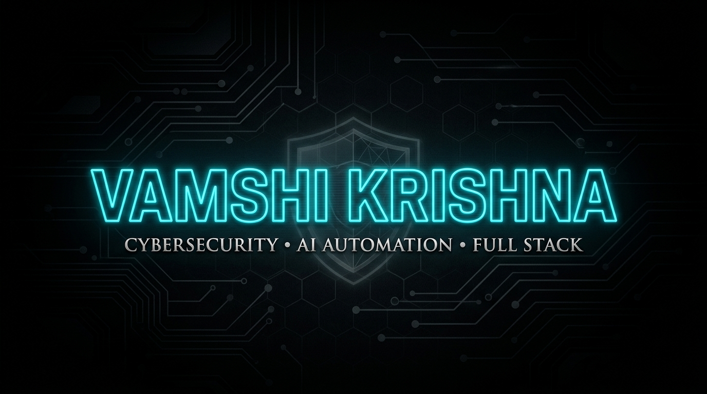

<p align="center">
  
</p>

<p align="center">
  
  
  
</p>

---

### 👤 OPERATOR INTEL
| METRIC | DIRECTIVE |
| :--- | :--- |
| **PRIMARY MISSION** | Architecting bulletproof backend systems & automated security operations |
| **ACTIVE TARGETS** | Penetration testing, vulnerability scanning, and secure container configurations |
| **DEPLOYS TO** | India / Remote Systems |
| **OPERATIONAL LEVEL** | Seeking high-impact security engineering roles and project collaborations |

---

### 📡 TECH ARSENAL

#### 🛡️ SYSTEMS & SEC-OPS


#### 🤖 LANGUAGES & FRAMEWORKS


---

### 🎯 COMMAND MISSION LOG

```text
┌── [PHASE 01: CORE ARCHITECTURE] ──────────────────────────────────────┐
│  ✔ Devised high-performance backend APIs using FastAPI & Python       │
│  ✔ Established PostgreSQL database layers and secure migration flows  │
│  ✔ Deployed isolated testing suites using Docker micro-services       │
└───────────────────────────────────────────────────────────────────────┘

┌── [PHASE 02: ACTIVE OPERATIONS] ──────────────────────────────────────┐
│  ⏳ Penetration testing, systems hardening, and network vulnerability  │
│  ⏳ Developing automated script monitors and security posture tools   │
└───────────────────────────────────────────────────────────────────────┘

┌── [PHASE 03: AUTONOMOUS AGENTS] ──────────────────────────────────────┐
│  📅 Orchestrating multi-agent AI loops and secure CI/CD pipelines     │
└───────────────────────────────────────────────────────────────────────┘
```

---

### 📊 METRICS & LIVE TELEMETRY

<p align="center">
  
  
</p>

<p align="center">
  
</p>

---

### 📡 CONNECT LINK
`[SECURE CHANNEL]` 🔗 [Establish Connection on LinkedIn](https://linkedin.com/in/vamshi-krishna-42417122a)

```text
========================================================================
  [EOF] SYSTEM CONNECTION TERMINATED // SECURE OUT
========================================================================
```
