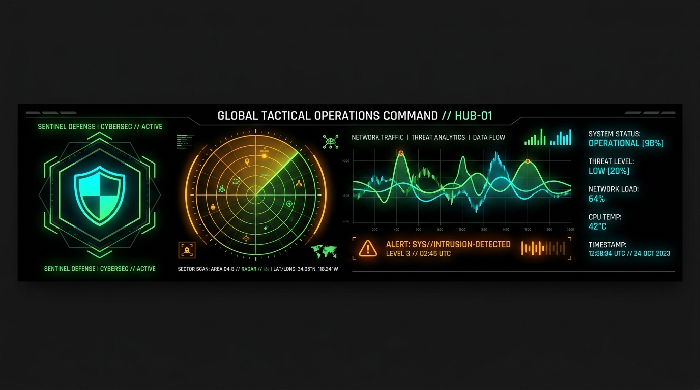

<p align="center">
  
</p>

## 🟢 SYSTEM STATUS: OPERATIONAL
`OPERATOR: Vamshi Krishna` // `SECURITY ACCESS: PUBLIC` // `SECTOR: CYBER & AI`

---

```text
[SYS.LOG] -------------------------------------------------------------
 MISSION  :: Build secure AI systems & defend cloud perimeters.
 FOCUS    :: Cybersecurity // Backend Architectures // Autonomous Agents
 STATUS   :: Active // Open to Projects & Technical Engagements
-----------------------------------------------------------------------
```

### 📡 STACK TELEMETRY

#### 🛡️ CYBER OPS & SYSTEMS


#### 🤖 SOFTWARE & AI SYSTEMS


---

### 🎯 ACTIVE MISSIONS (ROADMAP)
* 🟢 **PHASE 1 (CORE BUILD)**: Secure backend API frameworks (FastAPI/Docker/Postgres). `[DEPLOYED]`
* 🟡 **PHASE 2 (CYBER OPS)**: Cloud posture management, systems hardening & offensive testing. `[ACTIVE]`
* 🔴 **PHASE 3 (AI NETWORK)**: Deploying multi-agent AI frameworks & security pipelines. `[SCHED]`

---

### 📊 DATA FEED & ANALYTICS

<p align="center">
  
  
</p>

<p align="center">
  
</p>

---

### 📡 CONNECT SIGNAL
`[SECURE CHANNEL]` 🔗 [Establish Connection on LinkedIn](https://linkedin.com/in/vamshi-krishna-42417122a)

```text
========================================================================
  [EOF] SYSTEM CONNECTION TERMINATED // LOGGING OFF OPERATOR
========================================================================
```
